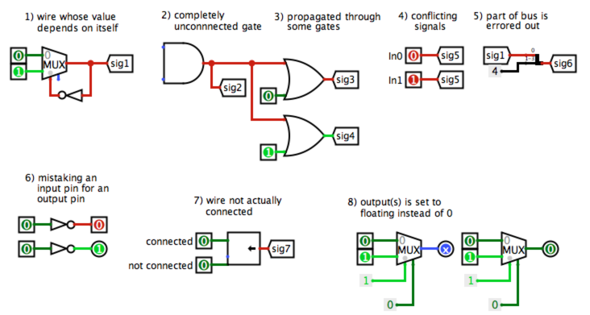
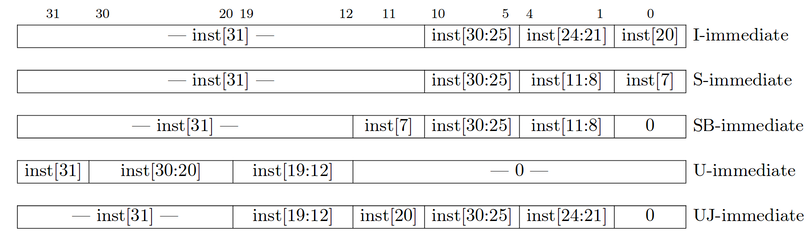
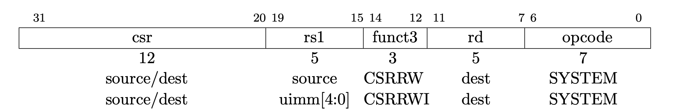

<style>
.container .row img {
  max-width: 100%;
}
</style>

## Overview

**Part A Deadline: Friday, October 16, 2020**

**Part B Deadline: Friday, October 30, 2020**

So you've (hopefully) dealt with CS61Classify. But, you might be wondering, how exactly do all those `sw ra, 40(sp)` instructions get executed? What's inside that mystery chip in your computer called the "CPU"? Welcome to Project 3!

In Part A (Tasks 1-3), you'll be wiring up the ALU and RegFile for a basic RISC-V CPU, as well as implementing the CPU datapath for executing `addi` instructions. In Part B (Tasks 4-5), you'll use these components (and others) to wire up a working CPU that runs actual RISC-V instructions!

---

## Tips and Guidelines

- Do not use the version of Logisim preinstalled on the Soda lab computers, as this will mess up your circuits! Use the `logisim-evolution.jar` provided in your project repository.
- You only allowed to use Logisim’s built-in blocks from the following libraries for all parts of this project: Wiring, Gates, Plexers, Arithmetic (**except divider**), Memory (**except RAM, Random Generator**).
- Save frequently and commit frequently! Try to save your code in Logisim every 5 minutes or so, and commit every time you produce a new feature, even if it is small.
- Sanity tests for most project tasks are included with the project starter code. More information is available under the Testing section of each task.
- See https://piazza.com/class/k755fag7yx2498?cid=891 for a custom tests and debugging walkthrough video
- Do not move the input and output pins in your circuit, since this could knock the pins out of alignment (in other words, autograder tests will fail)! Check the harness circuits, as well as `cpu.circ`, to make sure your circuits fit in the testing harnesses.
- You may make new subcircuits, but they must be located in the files given in the starter code. You may not make new `.circ` files; the autograder will fail you if you do this!
- You must use unique names for each subcircuit, failing to do so will create nightmares when trying to integrate components together. You may not change the names of any circuits provided in the starter files.
- `.circ` files use the XML format, which makes it hard for Git to automerge. We recommend working on a single computer at a time; if you use multiple computers, make sure that you have pushed and pulled your code before switching devices.
- We recommend completing Lab 05 and Lab 06 before starting on this project. Both labs cover many Logisim basics that will be useful for this project.
- Some common sources of Logisim errors, for your debugging convenience:


---

## Part A: Getting Started

For this project, the computer you're working on needs be able to run Java and Python 3, which you should have set up in Project 2. This project specification will use `python3` for sample commands; depending on your system, you may need to use `python` or `py` instead. We will be using Logisim Evolution, a Java-based GUI program, so we strongly recommend working on a laptop or desktop with Java installed and __a monitor directly attached__. Using window forwarding over a Hive SSH session is discouraged, and may lead to instability and general headaches.

Please follow the directions in this Google Form to get a repository: [https://forms.gle/ruhhX4e5ojozzNg48](https://forms.gle/ruhhX4e5ojozzNg48). After completing the form, clone your GitHub Classroom repository and add the starter code repository as a remote:

```bash
$ git clone YOUR_REPO_URL
$ cd YOUR_REPO_NAME
$ git remote add starter https://github.com/61c-teach/su20-proj3-starter.git
$ git pull starter master
```

If we make changes to the starter code, you can update your repository with `git pull starter master`.

---

## Task 1: Arithmetic Logic Unit (ALU)

Your first task is to create an ALU that supports all the operations needed by the instructions in our ISA (which is described in further detail in the next section). Please note that we treat overflow as RISC-V does with unsigned instructions, meaning that we ignore overflow.

We have provided a skeleton of an ALU for you in `alu.circ`. It has three
inputs:


| Input Name | Bit Width | Description                                                                                                        |
|------------|-----------|:-------------------------------------------------------------------------------------------------------------------|
| A          | 32        | Data to use for Input A in the ALU operation                                                                       |
| B          | 32        | Data to use for Input B in the ALU operation                                                                       |
| ALUSel     | 4         | Selects which operation the ALU should perform (see the list of operations with corresponding switch values below) |

... and one output:

| Output Name | Bit Width | Description                 |
|-------------|-----------|:----------------------------|
| Result      | 32        | Result of the ALU operation |

Below is the list of ALU operations for you to implement, along with their associated ALUSel values. All of them are required with the exception of `mulh`, which will take some extra effort to implement (but you're certainly up to the task!). You are allowed and encouraged to use built-in Logisim blocks to implement the arithmetic operations.

| Switch Value | Instruction                              |
|--------------|:-----------------------------------------|
| 0            | add: `Result = A + B`                    |
| 1            | and: `Result = A & B`                    |
| 2            | or: `Result = A | B`                     |
| 3            | xor: `Result = A ^ B`                    |
| 4            | srl: `Result = (unsigned) A >> B`        |
| 5            | sra: `Result = (signed) A >> B`          |
| 6            | sll: `Result = A << B`                   |
| 7            | slt: `Result = (A < B (signed)) ? 1 : 0` |
| 8            | Unused for this semester                 |
| 9            | Unused for this semester                 |
| 10           | mul: `Result = (signed) (A * B)[31:0]`   |
| 11           | mulhu: `Result = (A * B)[63:32]`         |
| 12           | sub: `Result = A - B`                    |
| 13           | bsel: `Result = B`                       |
| 14           | mulh: `Result = (signed) (A * B)[63:32]` |

When implementing `mul` and `mulh`, notice that the multiply block has a "Carry Out" output (the adder block also has this, but you will not need this). Experiment a bit with it, and see what you get for both the result and carryout with negative and positive 2's complement numbers. You should realize why we made `mulh` extra credit.

You can make any modifications to `alu.circ` you want, but the outputs **must** obey the behavior specified above. If you create additional subcircuits, they must also be in `alu.circ` (you may not make new `.circ` files). Additionally, your ALU **must** be able to fit in the provided harness `alu_harness.circ`. This means that you should take care not to move inputs or outputs. To verify that changes you made didn’t break anything, you can open `alu_harness.circ` and ensure there are no errors and that the circuit functions well.

**Hints:**

- `add` is already made for you; feel free to use a similar structure when implementing your other blocks.
- You can hover your cursor over an input/output on a block to get more detailed information about that input/output.
- If you want to know more details about each block, go to Help->Library Reference for more information on the block and its inputs and outputs.
- You might find bit splitters or extenders useful when implementing `sra` and `srl`.
- Use tunnels! They will make your wiring cleaner and easier to follow, and will reduce your chances of encountering crossed wires or unexpected errors.
- A multiplexer (MUX) might be useful when deciding which block output you want to ouput. In other words, consider simply processing the input in all blocks, and then outputing the one of your choice.

---

### ALU Testing

We've provided a group of ALU sanity tests in the `tests/part_a/alu` directory. Running the test runner for this group will run the ALU tests and produce output in the `tests/part_a/alu/student_output` directory.

```bash
$ python3 test_runner.py part_a alu
```

We've also provided `binary_to_hex_alu.py`, which can interpret this output in a readable format for you. To use it, do the following:

```bash
$ cd tests/part_a/alu
$ python3 binary_to_hex_alu.py PATH_TO_OUTPUT_FILE
```

For example, to see `reference_output/alu-add-ref.out` in readable format, you would do this:
```bash
$ cd tests/part_a/alu
$ python3 binary_to_hex_alu.py reference_output/alu-add-ref.out
```

If you want to see the difference between your output and the reference solution, put the readable outputs into new `.out` files and `diff` them. For example, for the `alu-add` test, you would do:

```bash
$ cd tests/part_a/alu
$ python3 binary_to_hex_alu.py reference_output/alu-add-ref.out > reference.out
$ python3 binary_to_hex_alu.py student_output/alu-add-student.out > student.out
$ diff reference.out student.out
```

---

## Task 2: Register File (RegFile)

As you learned in class, RISC-V architecture has 32 registers. For this project we will implement all of them. **To aid in debugging we have written the regfile to expose the 9 ports specified below**. Please make sure that the values of these register are attached to the proper outputs. 

Your RegFile should be able to write to or read from these registers specified in a given RISC-V instruction without affecting any other registers. There is one notable exception: your RegFile should NOT write to x0, even if an instruction tries. Remember that the zero register should ALWAYS have the value 0x0. You should NOT gate the clock at any point in your RegFile: the clock signal should ALWAYS connect directly to the clock input of the registers without passing through ANY combinational logic.

The exposed registers and their corresponding numbers are listed below.

| Register Number | Register Name |
|-----------------|---------------|
| x0              | x0            |
| x1              | ra            |
| x2              | sp            |
| x5              | t0            |
| x6              | t1            |
| x7              | t2            |
| x8              | s0            |
| x9              | s1            |
| x10             | a0            |


You are provided with the skeleton of a register file in `regfile.circ`. The register file circuit has six inputs:

| Input Name            | Bit Width | Description                                                                                                                                                                                                                               |
|-----------------------|-----------|:------------------------------------------------------------------------------------------------------------------------------------------------------------------------------------------------------------------------------------------|
| Clock                 | 1         | Input providing the clock. This signal can be sent into subcircuits or attached directly to the clock inputs of memory units in Logisim, but should not otherwise be gated (i.e., do not invert it, do not "and" it with anything, etc.). |
| RegWEn                | 1         | Determines whether data is written to the register file on the next rising edge of the clock.                                                                                                                                             |
| Read Register 1 (rs1) | 5         | Determines which register's value is sent to the Read Data 1 output, see below.                                                                                                                                                           |
| Read Register 2 (rs2) | 5         | Determines which register's value is sent to the Read Data 2 output, see below.                                                                                                                                                           |
| Write Register (rd)   | 5         | Determines which register to set to the value of Write Data on the next rising edge of the clock, assuming that RegWEn is a 1.                                                                                                            |
| Write Data (wb)       | 32        | Determines what data to write to the register identified by the Write Register input on the next rising edge of the clock, assuming that RegWEn is 1.                                                                                     |


The register file also has the following outputs:


| Output Name | Bit Width | Description                                                                    |
|-------------|-----------|:-------------------------------------------------------------------------------|
| rs1         | 32        | Driven with the value of the register identified by the Read Register 1 input. |
| rs2         | 32        | Driven with the value of the register identified by the Read Register 2 input. |
| `ra` Value  | 32        | Always driven with the value of `ra` (This is a DEBUG/TEST output.)            |
| `sp` Value  | 32        | Always driven with the value of `sp` (This is a DEBUG/TEST output.)            |
| `t0` Value  | 32        | Always driven with the value of `t0` (This is a DEBUG/TEST output.)            |
| `t1` Value  | 32        | Always driven with the value of `t1` (This is a DEBUG/TEST output.)            |
| `t2` Value  | 32        | Always driven with the value of `t2` (This is a DEBUG/TEST output.)            |
| `s0` Value  | 32        | Always driven with the value of `s0` (This is a DEBUG/TEST output.)            |
| `s1` Value  | 32        | Always driven with the value of `s1` (This is a DEBUG/TEST output.)            |
| `a0` Value  | 32        | Always driven with the value of `a0` (This is a DEBUG/TEST output.)            |


The test outputs at the top of your `regfile.circ` file are present for testing and debugging purposes. If you were implementing a real register file, you would omit those outputs. In our case, be sure they are included correctly--if they are not, you will not pass.

You can make any modifications to `regfile.circ` you want, but the outputs must obey the behavior specified above. If you create additional subcircuits, they must also be in `regfile.circ` (you may not make new `.circ` files). In addition, your `regfile.circ` that you submit **must** fit into the `regfile_harness.circ` file we have provided for you. This means that you should take care not to move inputs or outputs. To verify changes you have made didn't break anything, you can open `regfile_harness.circ` and ensure there are no errors and that the circuit functions well.

**Hints:**
- Take advantage of copy-paste! It might be a good idea to make one register completely and use it as a template for the others to avoid repetitive work.
- I would advise you not to use the enable input on your MUXes. In fact, you can turn that feature off. I would also advise you to also turn "three-state?" to off. Take a look at all the inputs to a logisim register and see what they all do.
- Again, MUXes are your friend, but also DeMUXes.
- Think about what happens in the register file after a single instruction is executed. Which values change? Which values stay the same? Registers are clock-triggered--what does that mean?
- Keep in mind registers have an "enable" input available, as well as a clock input.
- What is the value of `x0`?

---

### RegFile Testing

We've provided a group of RegFile sanity tests in the `tests/part_a/regfile` directory. Running the test runner for this group will run the ALU tests and produce output in the `tests/part_a/regfile/student_output` directory.

```bash
$ python3 test_runner.py part_a regfile
```

We've also provided `binary_to_hex_regfile.py`, which works like `binary_to_hex_alu.py` from Task 1.

---

## Task 3: The `addi` Instruction

As your final task for Part A, you're going to implement a CPU that's capable of executing one instruction: `addi`! You're welcome to implement other instructions at this time, but you'll only be graded on whether or not `addi` executes correctly for Part A. When we release Part B, there will be more detailed instructions on how to implement the other instructions.

### Info: Memory

The Memory unit (located in `mem.circ`) is already fully implemented for you! However, the `addi` instruction does NOT use the Memory unit, so you can leave it untouched for Part A. Note that the supplied memory is word-addressable but **byte** level write enabled. This means that the Write_En signal is 4 bits wide and acts as a write mask for the input data. For example, if Write_En is `1'b1000`, only the most significant byte of the addressed word in memory will be overwritten. The ReadData port will always return the value in memory at the supplied address, regardless of Write_En.

Here's a quick summary of its inputs and outputs:

| Signal Name | Direction | Bit Width | Description                                                              |
|-------------|-----------|-----------|:-------------------------------------------------------------------------|
| WriteAdd    | Input     | 32        | Address to read/write to in Memory                                       |
| WriteData   | Input     | 32        | Value to be written to Memory                                            |
| Write_En    | Input     | 4         | The write mask for instructions that write to Memory and zero otherwise  |
| CLK         | Input     | 1         | Driven by the clock input to the CPU                                     |
| ReadData    | Output    | 32        | Value of the data stored at the specified address                        |

---

### Info: Branch Comparator

The Branch Comparator unit (located in `branch_comp.circ`) provided in the skeleton is unimplemented, but the `addi` instruction does NOT use the Branch Comparator unit, so you don't have to worry about it for Part A.

If you are interested, here's a quick summary of its inputs and outputs:

| Signal Name | Direction | Bit Width | Description                                                                                    |
|-------------|-----------|-----------|:-----------------------------------------------------------------------------------------------|
| rs1         | Input     | 32        | Value in the first register to be compared                                                     |
| rs2         | Input     | 32        | Value in the second register to be compared                                                    |
| BrUn        | Input     | 1         | Equal to one when an unsigned comparison is wanted, or zero when a signed comparison is wanted |
| BrEq        | Output    | 1         | Equal to one if the two values are equal                                                       |
| BrLt        | Output    | 1         | Equal to one if the value in rs1 is less than the value in rs2                                 |

---

### Info: Immediate Generator

The Immediate Generator ("Imm Gen") unit (located in `imm_gen.circ`) provided in the skeleton is unimplemented. The `addi` instruction requires an immediate generator, but for now you can hard-wire it to construct the immediate for the `addi` instruction, without worrying about other immediate types.

To edit this subcircuit, edit the `imm_gen.circ` file and not the `imm_gen` in `cpu.circ`. Note that if you modify this circuit, you will need to close and open `cpu.circ` to load the changes in your CPU.

Here's a quick summary of its inputs and outputs:

| Signal Name | Direction | Bit Width | Description                                        |
|-------------|-----------|-----------|:---------------------------------------------------|
| inst        | Input     | 32        | The instruction being executed                     |
| ImmSel      | Input     | 3         | Value determining how to reconstruct the immediate |
| imm         | Output    | 32        | Value of the immediate in the instruction          |

---

### Info: Processor

We have provided a skeleton for your processor in `cpu.circ`. You will be using your own implementations of the ALU and RegFile as you construct your datapath. You are responsible for constructing the entire datapath from scratch. For Part A, your completed processor should support the `addi` instruction using a two-stage pipeline, with IF in the first stage and ID, EX, MEM, and WB in the second stage. To start, however, we recommend you create a single-stage processor with no pipelining. Once that is working, you can modify your processor so that it has a 2-stage pipeline.


Your processor will sit in a processor harness `test_harness.circ` that contains the Memory unit (this organization will make sense at the end of Part B). That processor harness then sits in a testing harness `run.circ` that provides the instuctions to the processor. Your process will output the address of an instruction, and accept the instruction at that address as an input. It will also output the data memory address, data memory write enable, and accept the data at that address as an input. Essentially, these two test harnesses are your data memory and instruction respectively. We recommend that you take some time to inspect `test_harness.circ` and `run.circ` to see exactly what's going on; this same harness will be used in the tests provided to you for sanity checking, so make sure your CPU fits in the harness before testing and submitting your work! Your processor has 3 inputs that come from the harness:

| Input Name  | Bit Width | Description                                                                                                                                                                                                                                                                                             |
|-------------|-----------|:--------------------------------------------------------------------------------------------------------------------------------------------------------------------------------------------------------------------------------------------------------------------------------------------------------|
| READ_DATA   | 32        | Driven with the data at the data memory address identified by the WRITE_ADDRESS (see below).             
| INSTRUCTION | 32        | Driven with the instruction at the instruction memory address identified by the FETCH_ADDRESS (see below).                                                                                                                                                                                              |
| CLOCK       | 1         | The input for the clock. As with the register file, this can be sent into subcircuits (e.g. the CLK input for your register file) or attached directly to the clock inputs of memory units in Logisim, but should not otherwise be gated (i.e., do not invert it, do not `AND` it with anything, etc.). |

Your processor must provide the following outputs to the first level harness:

| Output Name    | Bit Width | Description                                                                                             |
|----------------|-----------|:--------------------------------------------------------------------------------------------------------|
| ra             | 32        | Driven with the contents of `ra` (FOR TESTING)                                                          |
| sp             | 32        | Driven with the contents of `sp` (FOR TESTING)                                                          |
| t0             | 32        | Driven with the contents of `t0` (FOR TESTING)                                                          |
| t1             | 32        | Driven with the contents of `t1` (FOR TESTING)                                                          |
| t2             | 32        | Driven with the contents of `t2` (FOR TESTING)                                                          |
| s0             | 32        | Driven with the contents of `s0` (FOR TESTING)                                                          |
| s1             | 32        | Driven with the contents of `s1` (FOR TESTING)                                                          |
| a0             | 32        | Driven with the contents of `a0` (FOR TESTING)                                                          |
| WRITE_ADDRESS  | 32        | This output is used to select which address to read/write data from in data memory.                     |
| WRITE_DATA     | 32        | This output is used to provide write data to data memory.                                               |
| WRITE_ENABLE   | 4         | This output is used to provide the write enable mask to data memory.                                    |
| fetch_addr     | 32        | This output is used to select which instruction is presented to the processor on the INSTRUCTION input. |

Just like with the ALU and RegFile, be careful **NOT** to move the input or output pins! See the "Testing" section for more information on the harness and tests.

---

### Info: Control Logic

The Control Logic unit (`control_logic.circ`) provided in the skeleton is unimplemented. Designing your control logic unit will probably be your biggest challenge in Part B. For Part A, you can put a constant for each control signal, because `addi` is the only instruction you'll be implementing. As you implement `addi`, think about where you'll need to make additions in order to support other instructions.

To edit this subcircuit, edit the `control_logic.circ` file and not the `control_logic` in `cpu.circ`. Note that if you modify this circuit, you will need to close and open `cpu.circ` to load the changes in your CPU.

---

### Single Stage CPU: A Guide

We know that trying to build a CPU with a blank slate might be intimidating, so we wrote the following guide to help you.

Recall the five stages of the CPU pipeline:

1. Instruction Fetch (IF)
2. Instruction Decode (ID)
3. Execute (EX)
4. Memory (MEM)
5. Write Back (WB)

This guide will help you work through each of these stages for the `addi` instruction. Each section will contain questions for you to think through and pointers to important details, but it won't tell you exactly how to implement the instruction.

You may need to read and understand each question before going to the next one, and you can see the answers by *clicking on the question*. During your implementation, feel free to place things in subcircuits as you see fit.

#### Stage 1: Instruction Fetch

The main thing we are concerned about in this stage is: how do we get the current instruction? From lecture, we know that instructions are stored in the instruction memory, and each of these instructions can be accessed through an address.

<details>
  <summary>1. Which file in the project holds your instruction memory? How does it connect to your `cpu.circ` file?</summary>

  The instruction memory is the ROM module in `run.circ`. It provides an input into your CPU named `INSTRUCTION` and takes an output from your CPU. In your `cpu.circ` file, that output is called `PROGRAM_COUNTER`. In `run.circ`, it is called `fetch_addr`.
</details>

<details>
  <summary>2. In your CPU, how would changing the address you output as `PROGRAM_COUNTER` affect the instruction input?</summary>

  The instruction that `run.circ` outputs to your CPU should be the instruction at address `PROGRAM_COUNTER` (or `fetch_addr`) in instruction memory.
</details>

<details>
  <summary>3. How do you know what `PROGRAM_COUNTER` should be?</summary>

  `PROGRAM_COUNTER` is the address of the current instruction being executed, so it is saved in the PC register. For this project, your PC will start at 0, as that is the default value for a register.
</details>

<details>
  <summary>4. For basic programs without any jumps or branches, how will the PC change from line to line?</summary>

  The PC must increment by 1 instruction in order to go to the next instruction, as the address held by the PC register represents what instruction to execute. This means that your PC will typically increase by 4 (assuming no branch or jump) line to line.
</details>

<br>

In `cpu.circ`, we have provided a simple PC register implementation - ignoring jumps and branches. You will implement branches and jumps in Part 2 of the project, but for now we are only concerned with being able to run `addi` instructions.

Remember that we will in the end implement a 2-stage pipelined processor, so the IF stage is separate from the remaining stages. What circuitry separates the different stages of a pipeline? Specifically, what circuitry separates IF from the next stage? Will you need to add anything?

#### Stage 2: Instruction Decode

Now that we have our instruction coming from the `instruction` input, we break it down in the Instruction Decode step according to the RISC-V instruction formats you have learned.

<details>
  <summary>1. What type of instruction is addi? What are the different bit fields and which bits are needed for each?</summary>

  I type. The fields are:
  - `imm [31-20]`
  - `rs1 [19-15]`
  - `funct3 [14-12]`
  - `rd [11-7]`
  - `opcode [6-0]`
</details>

<details>
  <summary>2. In Logisim, what tool would you use to **split** out different groups of bits?</summary>

  The Splitter!
</details>

<p>3. Implement the instruction field decode stage using the instruction input. You should use tunnels to label and group the bits.</p>

<details>
  <summary>4. Now we need to get the data from the corresponding registers, using the register file. Which instruction fields should be connected to the register file? Which inputs of the register file should it connect to?</summary>

  Instruction field `rs1` will need to connect to read register 1.
</details>

<p>5. Implement reading from the register file. You will have to bring in your RegFile from Part A. Remember to connect the clock!</p>

<details>
  <summary>6. What does the Immediate Generator need to do?</summary>

  For addi, the immediate generator takes in 12 bits from the instruction and produces a signed 32-bit immediate. You will need to implement this logic in the Immediate Generator subcircuit!
</details>

#### Stage 3: Execute

The Execute stage is where the computation of most instructions is performed. This is also where we will introduce the idea of using a Control Module.

<details>
  <summary>1. For the add instruction, what should be your inputs to the ALU?</summary>

  Read Data 1 (rs1) and the immediate produced by the Immediate Generator.
</details>

<details>
  <summary>2. In the ALU, what is the purpose of ALU_Sel?</summary>

  It determines which operation the ALU will perform.
</details>

<details>
  <summary>3. Although it is possible for now to just put a constant as the ALUSel, why would this be infeasible as you implement more instructions?</summary>

  With more instructions, the input to the ALU might need to change, so you will need to have some sort of circuit that changes ALUSel depending on the instruction being executed.
</details>

<p>4. Bring in your ALU and connect the ALU inputs correctly. Do you need to connect the clock? Why or why not?</p>

<br>

#### Stage 4: Memory

The memory stage is where the memory can be written to using store instructions and read from using load instructions. Because the `addi` instruction does not use memory, we will not spend too much time here.

At this point, we cannot connect most of the inputs, as we don't know where they should come from.

#### Stage 5: Write Back

The write back stage is where the results of the operation is saved back to the registers.

<details>
  <summary>1. Do `addi` instructions need to write back to a register?</summary>

  Yes. `addi` takes the output of a an addition computation in the ALU and writes it back to the register file.
</details>

<p>2. Let's create the write back phase so that it is able to write both ALU and MEM outputs to the Register File. Later, when you implement branching/jumping, you may need to add more to this mux. However, at the moment, we need to choose between the ALU and MEM outputs, as only one wire can end up being an input to the register file. Bring a wire from both the ALU and `READ_DATA`, and connect it to a MUX.</p>

<details>
  <summary>3. What should you use as the Select input to the MUX? What does the input depend on?</summary>

  This input should be able to choose between three MUX inputs: (1) ALU, (2) MEM [`READ_DATA`], and (3) PC + 4 (when will you use this?) The control signal that determines which of these inputs is written back is called WBSel. For now, there should only be one value that WBSel can take on -- whatever it should be for `addi`.
</details>

<details>
  <summary>4. Now that we have the inputs to the MUX sorted out, we need to wire the output. Where should the output connect to?</summary>

  Because the output is the data that you want to write into the Register File, it should connect to the Write Data input on the Register File.
</details>

<p>5. There are two more inputs on the Register File which are important for writing data: RegWEn and rd. One of these will come from the Instruction Decode stage and the other one will be a new control signal that you need to design for Part B. Please finish off the Writeback stage by these inputs on the RegFile correctly.</p>

If you have done all of the steps correctly, you should have a single-cycle processor that works for `addi` instructions.

Run `python3 test_runner.py part_a addi_single` and see if it's working correctly!

---

### Pipelining Your CPU

Now it's time to implement pipelining in your CPU! For this project, you'll need to implement a 2-stage pipeline, which is still conceptually similar to the 5-stage pipeline covered in lecture and discussion (review those if you haven't already). The two stages you'll implement are:

**1. Instruction Fetch:** An instruction is fetched from the instruction memory.

**2. Execute:** The instruction is decoded, executed, and committed (written back). This is a combination of the remaining four stages of a normal five-stage RISC-V pipeline (ID, EX, MEM and WB).

Because all of the control and execution is handled in the Execute stage, **your processor should be more or less indistinguishable from a single-cycle implementation, barring the one-cycle startup latency.** However, we will be enforcing the two-stage pipeline design. Some things to consider:

- Will the IF and EX stages have the same or different `PC` values?
- Do you need to store the `PC` between the pipelining stages?

You might also notice a bootstrapping problem here: during the first cycle, the instruction register sitting between the pipeline stages won't contain an instruction loaded from memory. How do we deal with this? It happens that Logisim automatically sets registers to zero on reset; the instruction register will then contain a `nop`. We will allow you to depend on this behavior of Logisim. Remember to go to Simulate `-->` Reset Simulation (Cmd + R or Ctrl + R on Windows) to reset your processor.

After pipelining your processor, you should be able to pass `python3 test_runner.py part_a addi_pipelined` test. Note that the single-stage test will now fail, which is expected behavior (why? look back at the reference outputs for each test, and think about the effects of pipelining on different stages).

---

### Testing

#### Understanding the Tests

Each test is a copy of the `run.circ` file included with the starter code that has instructions loaded into its IMEM. When you run logisim-evolution from the command line, the clock ticks, the program counter is incremented, and the values in each of the outputs is printed to stdout.

Let's take as the one stage addi test as an example. It has 3 addi instructions (`addi t0, x0, 5`, `addi t1, t0, 7`, `addi s0, t0, 9`). Open `tests/part_a/addi_pipelined/cpu-addi-pipelined.circ` in Logisim Evolution, and take a closer look at the various parts of the test file. At the top, you'll see the place where your CPU is connected to the test outputs. With the starter code, you'll see all xxxx's, as you do below; when your CPU is working, this should not be the case. Your CPU takes in one input (instruction), and along with the values in each of the registers, it has one additional output: `fetch_addr`, or the address of the instruction to be fetched from IMEM to be executed the next clock cycle.

Be careful that you don't move any of the inputs/outputs of your CPU around, or add any additional inputs/outputs. This will change the shape of the CPU subcircuit, and as a result the connections in the test files may no longer work properly.

Below the CPU, you'll see instruction memory. The hex for the 3 addi instructions (0x00500293, 0x00728313, 0x00928413) has been loaded into instruction memory. Instruction memory takes in one input (called `fetch_addr`) and outputs the instruction at that address. `fetch_addr` is a 32-bit value, but because Logisim Evolution caps the size of ROM units at 2^16B, we have to use a splitter to get only 14 bits from `fetch_addr` (ignoring the bottommost two bits). Notice that `fetch_addr` is a **byte address**, not a word address.

So what happens when the clock ticks? Each tick of the clock increments an input in the test file called `Time_Step`. The clock will continue to tick until `Time_Step` is equal to the halting constant for that test file (for this particular test file, the halting constant is 5). At that point, the Logisim Evolution command line will print the values in each of your outputs to stdout. Our tests will compare this output to the expected; if your output is different, you will fail the test.

#### `addi` Tests

We've included 2 tests for the `addi` instruction with the starter code: one for a single-cycle CPU and one for a pipelined CPU. You can run the pipelined tests with the following commands (replace `pipelined` with `single` for single-cycle tests):

```bash
$ python3 test_runner.py part_a addi_pipelined # For a pipelined CPU
```

You can see the `.s` (RISC-V) and `.hex` (machine code) files for the test in `tests/part_a/addi_pipelined/inputs`.

We've included a Python script to interpret your output: `binary_to_hex_cpu.py`, which works like `binary_to_hex_alu.py` and `binary_to_hex_regfile.py` from the previous tasks. To use the script to see your CPU's output, run:

```bash
$ cd tests/part_a/addi_pipelined
$ python3 binary_to_hex_cpu.py student_output/CPU-addi-pipelined-student.out
```

or, to see the reference output, run:

```bash
$ cd tests/part_a/addi_pipelined
$ python3 binary_to_hex_cpu.py reference_output/CPU-addi-pipelined-ref.out
```

---

## Part A: Submission

At this point, if you've completed tasks 1-3, you've finished Part A of the project!

Double-check that you have not moved your input/output pins, and that your circuits fit in the provided testing harnesses. Make sure that you did not create any additional `.circ` files; the autograder will only be testing the circuit files you needed to edit in the starter code (`alu.circ`, `branch_comp.circ`, `control_logic.circ`, `cpu.circ`, `imm_gen.circ`, and `regfile.circ`). Submit your repo to the `Project 3A` assignment on Gradescope.

The autograder for Part A uses the same tests as the test files provided in the starter code.

The rest of this spec describes the tasks for Part B.

---

## Part B: Getting Started

We'll still be using the same repository. Pull the starter code to get the files for Part B.

```bash
$ git pull starter master
```

---

## Task 4: More Instructions

In Task 3, you wired up a basic pipelined CPU capable of executing `addi` instructions. Now, you'll implement support for more instructions!

### The Instruction Set Architecture (ISA)

We will be grading your CPU implementation on **only** the instructions listed below. Your CPU must support these instructions, but feel free to implement any additional instructions you want as long as they don't affect your implementation of the required instructions. Implementing additional instructions will not affect your score.

<table>
  <tr>
    <td><b>Instruction</b></td>
    <td><b>Type</b></td>
    <td><b>Opcode</b></td>
    <td><b>Funct3</b></td>
    <td><b>Funct7/Immediate</b></td>
    <td><b>Operation</b></td>
  </tr>
  <tr>
    <td>add rd, rs1, rs2</td>
    <td rowspan="14">R</td>
    <td rowspan="14">0x33</td>
    <td>0x0</td>
    <td>0x00</td>
    <td>R[rd] &larr; R[rs1] + R[rs2]</td>
  </tr>
  <tr>
    <td>mul rd, rs1, rs2</td>
    <td>0x0</td>
    <td>0x01</td>
    <td>R[rd] &larr; (R[rs1] * R[rs2])[31:0]</td>
  </tr>
  <tr>
    <td>sub rd, rs1, rs2</td>
    <td>0x0</td>
    <td>0x20</td>
    <td>R[rd] &larr; R[rs1] - R[rs2]</td>
  </tr>
  <tr>
    <td>sll rd, rs1, rs2</td>
    <td>0x1</td>
    <td>0x00</td>
    <td>R[rd] &larr; R[rs1] &lt;&lt; R[rs2]</td>
  </tr>
  <tr>
    <td>mulh rd, rs1, rs2</td>
    <td>0x1</td>
    <td>0x01</td>
    <td>R[rd] &larr; (R[rs1] * R [rs2])[63:32]</td>
  </tr>
  <tr>
    <td>mulhu rd, rs1, rs2</td>
    <td>0x3</td>
    <td>0x01</td>
    <td>(unsigned) R[rd] &larr; (R[rs1] * R[rs2])[63:32]</td>
  </tr>
  <tr>
    <td>slt rd, rs1, rs2</td>
    <td>0x2</td>
    <td>0x00</td>
    <td>R[rd] &larr; (R[rs1] &lt; R[rs2]) ? 1 : 0 (signed)</td>
  </tr>
  <tr>
    <td>xor rd, rs1, rs2</td>
    <td>0x4</td>
    <td>0x00</td>
    <td>R[rd] &larr; R[rs1] ^ R[rs2]</td>
  </tr>
  <tr>
    <td>divu rd, rs1, rs2</td>
    <td>0x5</td>
    <td>0x01</td>
    <td>(unsigned) R[rd] &larr; R[rs1] / R[rs2]</td>
  </tr>
  <tr>
    <td>srl rd, rs1, rs2</td>
    <td>0x5</td>
    <td>0x00</td>
    <td>(unsigned) R[rd] &larr; R[rs1] &gt;&gt; R[rs2]</td>
  </tr>
 <tr>
    <td>sra rd, rs1, rs2</td>
    <td>0x5</td>
    <td>0x20</td>
    <td>(signed) R[rd] &larr; R[rs1] &gt;&gt; R[rs2]</td>
  </tr>
  <tr>
    <td>or rd, rs1, rs2</td>
    <td>0x6</td>
    <td>0x00</td>
    <td>R[rd] &larr; R[rs1] | R[rs2]</td>
  </tr>
  <tr>
    <td>remu rd, rs1, rs2</td>
    <td>0x7</td>
    <td>0x01</td>
    <td>(unsigned) R[rd] &larr; R[rs1] % R[rs2]</td>
  </tr>
  <tr>
    <td>and rd, rs1, rs2</td>
    <td>0x7</td>
    <td>0x00</td>
    <td>R[rd] &larr; R[rs1] &amp; R[rs2]</td>
  </tr>
  <tr>
    <td>lb rd, offset(rs1)</td>
    <td rowspan="11">I</td>
    <td rowspan="3">0x03</td>
    <td>0x0</td>
    <td></td>
    <td>R[rd] &larr; SignExt(Mem(R[rs1] + offset, byte))</td>
  </tr>
  <tr>
    <td>lh rd, offset(rs1)</td>
    <td>0x1</td>
    <td></td>
    <td>R[rd] &larr; SignExt(Mem(R[rs1] + offset, half))</td>
  </tr>
  <tr>
    <td>lw rd, offset(rs1)</td>
    <td>0x2</td>
    <td></td>
    <td>R[rd] &larr; Mem(R[rs1] + offset, word)</td>
  </tr>
  <tr>
    <td>addi rd, rs1, imm</td>
    <td rowspan="8">0x13</td>
    <td>0x0</td>
    <td></td>
    <td>R[rd] &larr; R[rs1] + imm</td>
  </tr>
  <tr>
    <td>slli rd, rs1, imm</td>
    <td>0x1</td>
    <td>0x00</td>
    <td>R[rd] &larr; R[rs1] &lt;&lt; imm</td>
  </tr>
  <tr>
    <td>slti rd, rs1, imm</td>
    <td>0x2</td>
    <td></td>
    <td>R[rd] &larr; (R[rs1] &lt; imm) ? 1 : 0</td>
  </tr>
  <tr>
    <td>xori rd, rs1, imm</td>
    <td>0x4</td>
    <td></td>
    <td>R[rd] &larr; R[rs1] ^ imm</td>
  </tr>
  <tr>
    <td>srli rd, rs1, imm</td>
    <td>0x5</td>
    <td>0x00</td>
    <td>R[rd] &larr; R[rs1] &gt;&gt; imm</td>
  </tr>
  <tr>
     <td>srai rd, rs1, imm</td>
    <td>0x5</td>
    <td>0x20</td>
    <td>R[rd] &larr; R[rs1] &gt;&gt; imm</td>
  </tr>
  <tr>
    <td>ori rd, rs1, imm</td>
    <td>0x6</td>
    <td></td>
    <td>R[rd] &larr; R[rs1] | imm</td>
  </tr>
  <tr>
    <td>andi rd, rs1, imm</td>
    <td>0x7</td>
    <td></td>
    <td>R[rd] &larr; R[rs1] &amp; imm</td>
  </tr>
  <tr>
    <td>sb rs2, offset(rs1)</td>
    <td rowspan="4">S</td>
    <td rowspan="4">0x23</td>
    <td>0x0</td>
    <td></td>
    <td>Mem(R[rs1] + offset) &larr; R[rs2][7:0]</td>
  </tr>
    <tr>
    <td>sh rs2, offset(rs1)</td>
    <td>0x1</td>
    <td></td>
    <td>Mem(R[rs1] + offset) &larr; R[rs2][15:0]</td>
  </tr>
  <tr>
    <td>sw rs2, offset(rs1)</td>
    <td>0x2</td>
    <td></td>
    <td>Mem(R[rs1] + offset) &larr; R[rs2]</td>
  </tr>
  <tr>
    <td>swlt rs2, offset(rs1)</td>
    <td>0x7</td>
    <td></td>
    <td class="c8">
    if(R[rs2] < offset (signed))
        <br/>
        &nbsp;Mem(R[rs1]) &larr; R[rs2]</td>
  </tr>
  <tr>
    <td>beq rs1, rs2, offset</td>
    <td rowspan="6">SB</td>
    <td rowspan="6">0x63</td>
    <td>0x0</td>
    <td></td>
    <td class="c8">
      if(R[rs1] == R[rs2])
      <br/>
      &nbsp;PC &larr; PC + {offset, 1b0}
    </td>
  </tr>
  <tr>
    <td>bne rs1, rs2, offset</td>
    <td>0x1</td>
    <td></td>
    <td class = "c8">
      if(R[rs1] != R[rs2])
      <br/>
      &nbsp;PC &larr;  PC + {offset, 1b0}
    </td>
  </tr>
  <tr>
    <td>blt rs1, rs2, offset</td>
    <td>0x4</td>
    <td></td>
    <td class="c8">
      if(R[rs1] <  R[rs2] (signed))
      <br/>
      &nbsp;PC &larr; PC + {offset, 1b0}
    </td>
  </tr>
  <tr>
    <td>bge rs1, rs2, offset</td>
    <td>0x5</td>
    <td></td>
    <td class="c8">
      if(R[rs1] >=  R[rs2] (signed))
      <br/>
      &nbsp;PC &larr; PC + {offset, 1b0}
    </td>
  </tr>
  <tr>
    <td>bltu rs1, rs2, offset</td>
    <td>0x6</td>
    <td></td>
    <td class="c8">
      if(R[rs1] <  R[rs2] (unsigned))
      <br/>
      &nbsp;PC &larr; PC + {offset, 1b0}
    </td>
  </tr>
  <tr>
    <td>bgeu rs1, rs2, offset</td>
    <td>0x7</td>
    <td></td>
    <td class="c8">
      if(R[rs1] >=  R[rs2] (unsigned))
      <br/>
      &nbsp;PC &larr; PC + {offset, 1b0}
    </td>
  </tr>
  <tr>
    <td>auipc rd, offset</td>
    <td rowspan="2">U</td>
    <td>0x17</td>
    <td></td>
    <td></td>
    <td>R[rd] &larr; PC + {offset, 12b0}</td>
  </tr>
  <tr>
    <td>lui rd, offset</td>
    <td>0x37</td>
    <td></td>
    <td></td>
    <td>R[rd] &larr; {offset, 12b0}</td>
  </tr>
  <tr>
    <td>jal rd, imm</td>
    <td>UJ</td>
    <td>0x6f</td>
    <td></td>
    <td></td>
    <td class="c8">
      R[rd] &larr; PC  +  4
      <br/>
      &nbsp;PC &larr; PC + {imm, 1b0}
    </td>
  </tr>
  <tr>
    <td>jalr rd, rs1, imm</td>
    <td>I</td>
    <td>0x67</td>
    <td>0x0</td>
    <td></td>
    <td class="c8">
      R[rd] &larr; PC  +  4
      <br/>
      &nbsp;PC &larr; R[rs1] + {imm}
    </td>
  </tr>
  <tr>
    <td>csrw rd, csr, rs1</td>
    <td>I</td>
    <td>0x73</td>
    <td>0x1</td>
    <td></td>
    <td class="c8">
      CSR[csr] &larr; R[rs1]
    </td>
  </tr>
  <tr>
    <td>csrwi rd, csr, uimm</td>
    <td>I</td>
    <td>0x73</td>
    <td>0x5</td>
    <td></td>
    <td class="c8">
      CSR[csr] &larr; {uimm}
    </td>
  </tr>
</table>

---

### Info: Memory

The Memory unit (located in `mem.circ`) is already fully implemented for you! You may use this circuit in your CPU, but the autograder will not accept any modifications to `mem.circ`.

Note that the address you give to memory is a byte address, but memory returns an entire word of memory. The memory unit ignores the bottom two bits of the address you provide to it, and treats its input as a **word address** rather than a **byte address**. For example, if you input the 32-bit address 0x0000_1007, it wil be treated as the word address 0x0000_1004, and you will get as output the 4 bytes at addresses 0x0000_1004, 0x0000_1005, 0x0000_1006, and 0x0000_1007.

Note that for the `lw`, `lh`, `sh`, `sw` instructions, the RISC-V ISA supports unaligned accesses, but implementing them is complicated. We'll only be implementing _aligned_ memory accesses in this project. This means that `lw` and `sw` will only operate on addresses that are multiples of 4, and `lh` and `sh` will only operate on addresses that are multiples of 2. You **must not** implement unaligned accesses; you would likely need to use stalling, which would result in your output not matching our expected output (bad for your score).

Rememver that the memory is also **byte** level write enabled. This means that the Write_En signal is 4 bits wide and acts as a write mask for the input data. For example, if Write_En is `1'b1000`, only the most significant byte of the addressed word in memory will be overwritten. The ReadData port will always return the value in memory at the supplied address, regardless of Write_En.

Again, here's a quick summary of its inputs and outputs:

| Signal Name | Direction | Bit Width | Description                                                              |
|-------------|-----------|-----------|:-------------------------------------------------------------------------|
| WriteAdd    | Input     | 32        | Address to read/write to in Memory                                       |
| WriteData   | Input     | 32        | Value to be written to Memory                                            |
| Write_En    | Input     | 4         | The write mask for instructions that write to Memory and zero otherwise  |
| CLK         | Input     | 1         | Driven by the clock input to the CPU                                     |
| ReadData    | Output    | 32        | Value of the data stored at the specified address                        |

---

### Info: Branch Comparator

The Branch Comparator unit (located in `branch_comp.circ`) compares two values and outputs control signals that will be used to make branching decisions. You will need to implement logic for this circuit.

To edit this subcircuit, edit the `branch_comp.circ` file and not the `branch_comp` in `cpu.circ`. Note that if you modify this circuit, you will need to close and open `cpu.circ` to load the changes in your CPU.

Again, here's a quick summary of its inputs and outputs:

| Signal Name | Direction | Bit Width | Description                                                                                    |
|-------------|-----------|-----------|:-----------------------------------------------------------------------------------------------|
| rs1         | Input     | 32        | Value in the first register to be compared                                                     |
| rs2         | Input     | 32        | Value in the second register to be compared                                                    |
| BrUn        | Input     | 1         | Equal to one when an unsigned comparison is wanted, or zero when a signed comparison is wanted |
| BrEq        | Output    | 1         | Equal to one if the two values are equal                                                       |
| BrLt        | Output    | 1         | Equal to one if the value in rs1 is less than the value in rs2                                 |

---

### Info: Immediate Generator

The Immediate Generator ("Imm Gen") unit (located in `imm_gen.circ`) extracts the appropriate immediate from `I`, `S`, `B`, `U`, and `J` type instructions. Remember that in RISC-V, all immediates that leave the immediate generator are 32-bits and sign-extended! See the table below for how each immediate should be formatted:



To edit this subcircuit, edit the `imm_gen.circ` file and not the `imm_gen` in `cpu.circ`. Note that if you modify this circuit, you will need to close and open `cpu.circ` to load the changes in your CPU.

Again, here's a quick summary of its inputs and outputs:

| Signal Name | Direction | Bit Width | Description                                        |
|-------------|-----------|-----------|:---------------------------------------------------|
| inst        | Input     | 32        | The instruction being executed                     |
| ImmSel      | Input     | 3         | Value determining how to reconstruct the immediate |
| imm         | Output    | 32        | Value of the immediate in the instruction          |

---

### Info: Control Logic

The Control Logic unit (`control_logic.circ`) provided in the skeleton is based on the control logic unit in the 5-stage CPU used in lecture and discussion. In order to correctly identify each instruction, control signals play a very important part in this project. However, figuring out all of the control signals may seem intimidating. We suggest taking a look at the lecture slides and discussion worksheets to get started. Try walking through the datapath with different types of instructions; when you see a MUX or other component, think about what selector/enable value you will need for that instruction.

There are a two major approaches to implementing the control logic so that it can extract the `opcode`/`funct3`/`funct7` from an instruction and set the control signals appropriately.

The recommended method is **hard-wired control**, as discussed in lecture, which is usually the preferred approach for RISC architectures like MIPS and RISC-V. Hard-wired control uses "AND", "OR", and "NOT" gates (along with the various components we've learned can be built from these gates, like MUXes and DEMUXes) to produce the appropriate control signals. An **instruction decoder** takes in an instruction and outputs all of the control signals for that instruction.

The other way to do it is to use **ROM control**. Every instruction implemented by a processor maps to an address in a Read-Only Memory (ROM) unit. At that address in the ROM is the control word for that instruction. An **address decoder** takes in an instruction and outputs the address of the control word for that instruction. This approach is common in CISC architectures like Intel's x86-64, and, in real life, offers some flexibility because it can be re-programmed by changing the contents of the ROM.

To edit this subcircuit, edit the `control_logic.circ` file and not the `control_logic` in `cpu.circ`. Note that if you modify this circuit, you will need to close and open `cpu.circ` to load the changes in your CPU.

---

### Info: Control Status Register (CSR)

In order to run the testbenches that determine your project grades as well as the winners for the **Apple Contest** 🍎, there are a few more instructions that need to be added. A Control Status Register (CSR) holds additional information about the results of machine instructions, and it usually is stored independently of the register file and the memory. In your processor, you will be writing outputs to one of the CSRs that will be monitored by the test harness, and test successes and failures will be determined from that value. A value of 1 indicates success, and a value greater than 1 gives clues as to the location of the failure **NOTE: WILL WE GIVE THEM THE TESTS?** 

Below are the **2 CSR instructions** that you will need to implement. Note that while there are 2^12 possible CSR addresses, we will only use one of them (`tohost = 0x51E`). Morever, the immediate forms use a 5-bit zero-extended immediate (uimm) encoded in the `rs1` field.

1. `csrw tohost, t2` (short for `csrrw x0,csr,rs1`   where `csr=0x51E`)
2. `csrwi tohost, 1` (short for `csrrwi x0,csr,uimm` where `csr=0x51E`)



The Control Status Register unit skeleton (`csr.circ`) is provided with the starter code. In this unit, you will need to implement the `tohost` CSR register along with the write logic. **Please do not change the given connections as it will interfere with the testbench results!**

If you wish to learn more about CSR (not in scope), you can refer to Chapter 9 of the RISC-V specification.

---

### Info: Processor

The main CPU circuit (located in `cpu.circ`) implements the main datapath and connects all the subcircuits (ALU, Branch Comparator, Control Logic, Immediate Generator, Memory, and RegFile) together. In Part A, you implemented a simple two-stage pipeline in your CPU. Since Part B requires support for branch and jump instructions, you'll need to handle control hazards that occur when branching.

The instruction immediately after a branch or jump is not executed if a branch is taken. This makes your task a bit more complex. By the time you have figured out that a branch or jump is in the execute stage, you have already accessed the instruction memory and pulled out (possibly) the wrong instruction. You will therefore need to "kill" instruction that is being fetched if the instruction under execution is a jump or a taken branch.

Instruction kills for this project MUST be accomplished by MUXing a `nop` into the instruction stream and sending the `nop` into the Execute stage instead of using the fetched instruction. Notice that 0x00000013, or `addi x0, x0, 0` is a `nop` instruction; other `nop` instructions will work too. You should only kill if a branch is taken (do not kill otherwise). Do kill on every type of jump.

Do not solve this issue by calculating branch offsets in the IF stage. If we test your output against the reference every cycle, and the reference returns a `nop`, while it may be a conceptually correct solution, this will cause you to fail our tests.

Because all of the control and execution is handled in the Execute stage, **your processor should be more or less indistinguishable from a single-cycle implementation, barring the one-cycle startup latency and the branch/jump delays.** However, we will be enforcing the two-stage pipeline design. Some things to consider:

- Will the IF and EX stages have the same or different `PC` values?
- Do you need to store the `PC` between the pipelining stages?
- To MUX a `nop` into the instruction stream, do you place it *before* or *after* the instruction register?
- What address should be requested next while the EX stage executes a `nop`?  Is this different than normal?

You might also notice a bootstrapping problem here: during the first cycle, the instruction register sitting between the pipeline stages won't contain an instruction loaded from memory. How do we deal with this? It happens that Logisim automatically sets registers to zero on reset; the instruction register will then contain a `nop`. We will allow you to depend on this behavior of Logisim. Remember to go to Simulate `-->` Reset Simulation (Ctrl+R) to reset your processor.

---

### CPU Testing: Pipelined Sanity Tests

We've provided a group of basic sanity tests for your pipelined CPU in `tests/part_b/pipelined`.

```bash
$ python3 test_runner.py part_b pipelined
```

You can see the `.s` (RISC-V) and `.hex` (machine code) files for the test in `tests/part_b/pipelined/inputs`.

We've also provided `binary_to_hex_cpu.py`, which works like `binary_to_hex_cpu.py` from Task 3.

---

## Task 5: Custom Tests

The autograder tests fall into 3 main categories: **unit tests**, **integration tests**, and **edge case tests**. For Part B, we won't be revealing all the autograder tests, but you should be able to re-create a very close approximation of them on your own in order to test your CPU.

**Unit tests**: a unit test exercises your datapath with a single instruction, to make sure that each individual instruction has been implemented and is working as expected. You should write a different unit test for every single instruction that you need to implement, and make sure that you test the spectrum of possibilities for that instruction thoroughly. For example, a unit test `slt` should contain cases where `rs1 < rs2`, `rs1 > rs2`, and where `rs1 == rs2`.

**Integration tests**: After you've passed your unit tests, move onto tests that use multiple functions in combination. Try out various simple RISC-V programs that run a single function; your CPU should be able to handle them, if working properly. Feel free to try to use riscv-gcc to compile C programs to RISC-V, but be aware of the limited instruction set we're working with (you don't have any `ecall` instructions, for example). We'd recommend that you instead try to write simple functions on your own based on what you've seen in labs, discussions, projects, and exams.

**Edge case tests**: edge case tests try inputs that you normally wouldn't expect, which may trigger bugs in certain situations. What edge cases should you look for? A small hint from us: our 2 main classes of edge cases come from memory operations and branch/jump operations (some of the test names are "mem-full" and "br-jump-edge"). Think about all the different ways these operations could go wrong.

### Creating Custom Tests

We've included a script (`create-test.py`) that uses Venus to help you generate test circuits from RISC-V assembly! The process for generating a custom test is as follows:

1. Come up the RISC-V assembly instructions for the test, and save them in a file ending in `.s` in the `tests/part_b/custom/inputs` folder. The name of this file will be the name of your test. Note that your test **must** end in `.s`, and it **must** be located in the `tests/part_b/custom/inputs` folder. Repeat if you have more tests.
  - e.g. `tests/part_b/custom/inputs/sll-slli.s`, `tests/part_b/custom/inputs/slt.s`
2. Repeat step 1 if you have more tests.
3. To generate test circuits for your tests, run the `create-test.py` script:
```bash
$ cd tests/part_b/custom
$ python3 create-test.py inputs/sll-slli.s inputs/slt.s
```
This should generate a couple new files:
```
tests/part_b/custom:
  - <TEST_NAME>.circ # The new circuit for your test
  - inputs/<TEST_NAME>.s # The test file you wrote
  - inputs/<TEST_NAME>.hex # The machine code of the test file you wrote
  - reference_outputs/<TEST_NAME>-ref.out # The reference output for your test
```
4. Now you can run your tests!
```bash
$ python3 test_runner.py part_b custom
```

If you want to inspect the circuit running your test, you can simulate it by opening up the `CPU-<test name here>.circ` file, right-clicking on the CPU, selecting 'view main', and using Cmd + T (Ctrl + T on Windows) to manually tick the clock through each cycle. If you don't remember how to simulate your circuit, please refer back to the Logisim lab. We highly encourage you to poke your circuit while simulating the test to observe how your circuit reacts to various inputs (perhaps this can give you ideas for new tests to write).

If you wish to simulate your code only for a certain number of cycles, you can do that by using the `-n` flag:

```bash
$ python3 create_test.py -n <NUMBER_OF_CYCLES> <TEST_NAME>.s
```

If you would like to decode your output, use the provided `binary_to_hex_cpu.py`. Note that because you're implementing a 2-stage pipelined processor and the first instruction writes on the rising edge of the second clock cycle, the effects of your instructions will have a 2 instruction delay. For example, let's say you wrote a test with one instruction: `addi t0, x0, 1`. If you inspect the reference output, you'll see that `t0` isn't changed until the third cycle.

---

### Using Web Venus

Although we have specified three custom additional instructions, Venus does not support them because they are not standard or standard extension instructions. Because of this, one of your instructor's Stephan (the person maintaining Venus), made a package system with which you can make custom packages for Venus. There is a package which will add the *swlt* instructions to Venus so that you can properly test these custom instructions with the web version of Venus! 

Here is how you would go about doing this: Either 

1. Click on this link which should auto add the package ([https://venus.cs61c.org?packages=https://cs61c.org/su20/projects/proj3/proj3_2-venus_package.js](https://venus.cs61c.org?packages=https://cs61c.org/su20/projects/proj3/proj3_2-venus_package.js))

2. OR Go to [https://venus.cs61c.org](https://venus.cs61c.org?packages=https://cs61c.org/su20/projects/proj3/proj3_2-venus_package.js). Click on the Venus tab at the top (it is the left most one). Now look for the settings section (it should be on the right if your screen is large enough otherwise you will have to scroll down to see it). From there you should click on the Packages word to see the packages which you can enable/disable or add or remove. Next paste this link (https://cs61c.org/su20/projects/proj3/proj3_2-venus_package.js) in the box and then click add package. You should see a message saying `Loaded script (https://cs61c.org/su20/projects/proj3/proj3_2-venus_package.js)!` 

Now you can actually use the custom instructions in the web version of Venus just as if they were normal instructions!

### Test Coverage

**Test coverage**: a metric measuring how much of a given codebase is being tested by tests. For the purposes of this project, you will be graded on how much of the required ISA your tests cover.

The autograder for Part B will examine the coverage of tests located in the `tests/part_b/custom/inputs` folder. When you submit Part B to the autograder. The autograder will output a message about the percentage coverage of your tests against our staff suite of tests, and notify you if any of your tests raised a syntax error.

Hints:

- If you make many short test files rather than one large one, it will be easier to figure out which test and which line causes your Syntax Error (and to figure out where your CPU is failing). We'd recommend that for unit testing, where you have one .s file testing each instruction.
- Make sure you test every single instruction in the ISA, including the ones that are covered by the sanity tests; feel free to use the sanity tests as a model or even incorporate them as part of your test suite.
- Make sure you check that all registers are working.
- Make sure you don't have any "dummy" tests; if a test doesn't lead to a change in state or register value, it is not a meaningful test.
- Use only the registers we told you to implement: `x0`, `ra`, `sp`, `t0`, `t1`, `t2`, `s0`, `s1`, and `a0`.

---

## Part B: Submission

At this point, if you've completed tasks 4-5, you've finished Part B of the project. Congratulations on your shiny new CPU!

### Final Steps
**Your last bit of work before you submit is to write down how you implemented your CPU inside the readme.md. There is already a template for you to use and don't worry about going into too much detail, we just want you to reflect on what you did in this project and explain the reasoning behind the design choices you made (especially in your control logic)!**

Double-check that you have not moved your input/output pins, and that your circuits fit in the provided testing harnesses. Make sure that you did not create any additional `.circ` files; the autograder will only be testing the circuit files you needed to edit in the starter code (`branch_comp.circ`, `control_logic.circ`, `cpu.circ`, `imm_gen.circ`). Also make sure your custom `.s` tests are located in the right folder. 

### Verilog Generation
In order for us to run some comprehensive tests on your new CPU, we will be harnessing the built in features of Logisim to emit Verilog for your design. What is Verilog you might ask? Verilog is a hardware description language (HDL) used in industry; you can think of it as Logisim's more powerful and non-visual older brother. If you go on to take EECS151, you'll become very familiar with Verilog as you use it to create a 3 stage RISC-V processor! In order to emit for you design, please follow the following steps:

1. Open up `cpu.circ`.
2. In the top bar, click FPGA &rarr; Synthesize &amp; Download...
3. In the new window that pops up, click Settings.
4. Click Browse next to "Workspace location:" and navigate to <Your Project 3 Root Directory>/verilog. Click Open.
5. In the dropdown next to "Hardware description language used for FPGA-commander:" make sure that Verilog is selected.
6. Close the settings window.
7. Click Annotate, then click Execute, a new window should pop up if everything was done correctly and you did not use any unallowed blocks.
8. In the new window that pops up, click Done. A warning message will pop up, click Ok.

After running through these steps, your <Your Project 3 Root Directory>/verilog directory should contain a new folder. Explore the various files under that folder if you're curious about what Verilog looks like.

The autograder for Part B uses the sanity tests provided in the starter code, as well as hidden unit, integration, and edge case tests as specified in Task 5. Additionally, the autograder will be checking your custom tests for test coverage. 

---

## Frequently Asked Questions

- **Q**: I have pipelined my CPU, but the autograder said it detected a single-cycle one, what is the problem?<br/>
    **A**: If you're certain that you correctly pipelined, then it means that Logisim crashed when attempting to open your circuit. Generally this is caused by import issues, meaning you used a circuit that isn't in the correct place. Remember that you shouldn't be creating any new circ files and your ALU and RegFile files will be replaced with the staff solution, so don't use any subcircuits you created in those files in your CPU.<br/><br/>
- **Q**: I want to add more inputs and outputs to one of my circuits. Is this allowed?<br/>
  **A**: This is allowed, however beware of messing up your circuit appearance. This can cause pins to move to the wrong place and make you fail all the sanity tests. You can check you circuit appearance by right-clicking on your circuit and selecting "Edit Circuit Appearance" to move the new pins around if necessary, though this is not recommended. **WARNING: If you fail autograder tests because of added inputs/outputs we will not allow you to fix and resubmit after the deadline.** If you want to add extra logic or controls to your CPU (for swlt for example) we recommend making a control subcircuit in cpu.circ.<br/><br/>
- **Q**: Are we allowed to use all the Logisim main library blocks? Where can I find information on them?<br/>
    **A**: Yes, you can use any blocks that you can find in Logisim's main library. You can find information on these blocks by going to Help->Library Reference.<br/>

---

## Grading

The grading breakdown for Project 3 is as follows:

- Part A (20%, 23% with extra credit)
  - ALU (8%, 11% with `mulh` extra credit)
  - RegFile (8%)
  - Pipelined `addi` (4%)
- Part B (80%)
  - Sanity Tests (15%)
  - Test Coverage (10%)
  - Hidden Unit, Integration, and Edge Case Tests (55%)
